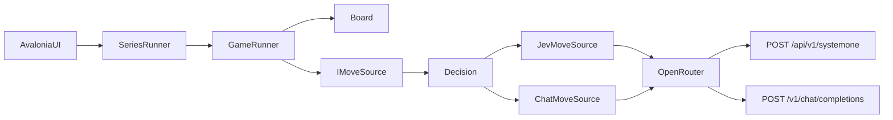

# AI vs AI Connect 4 (C# / Avalonia)

A watchable desktop arena. Board in the centre. One model picker on each side. Default is Jev 1.13 (Red, left) against Luna (Yellow, right). Both sides call OpenRouter with `OPENROUTER_API_KEY`.

You can run a series of N games with the same settings. Win counts sit above each side so you can watch the score climb without reading a log.

Jev is not a chat model. It answers one Choice question per call. The whole game is built around that shape. Every model call, including chat models, is one decision. Which legal column do you play right now? No multi-move plans. No open-ended chat turns. Chat adapters only translate that same decision into `/v1/chat/completions`.

## Domain types (name these before code)

- `Column`. Values 1 through 7 only. Array index is `column - 1`. No 0-based column type.
- `Player`. Red or Yellow. Left and right are UI only.
- `Board`. Immutable 6x7 grid. Row 0 is the bottom. `Drop(Player, Column)` returns a new board or rejects the column. `LegalColumns()` returns 1-7.
- `Decision`. The only thing a model is asked. Shared board `state`, one Choice question ("Which legal column should you play?"), and `criteria` equal to the current `LegalColumns()`. Both Jev and chat adapters consume this type. No free-form prompt owns the move.
- `GameStatus`. `Ready | Running | Paused | Finished(Win(Player, WinningLine) | Draw) | Aborted(reason)`. Not a pile of bools.
- `SeriesScore`. `RedWins`, `YellowWins`, `Draws`. Non-negative ints. Incremented only when a game reaches `Finished`. An abort does not add a win.
- `SeriesConfig`. `GameCount` as an int >= 1. Default 1. Locked when Play starts.
- `SeriesStatus`. `Ready | Running | Paused | Finished | Aborted(reason)`. Owns how many games remain. Holds the live `SeriesScore`.
- `Move`. Player, Column, `Model` or `Retry`. No silent fallback column.
- `MoveTiming`. Player, duration, `Applied | Aborted | Cancelled`.
- `ModelProfile`. Display name, model id, `ApiKind` (`SystemOne` | `ChatCompletions`), `SupportsEffort`, `SupportsSpeed`.
- `IMoveSource`. `GetMoveAsync(Decision, CancellationToken)` returns a `Column` or a typed failure. Adapters close over `ModelProfile`. Core has no `MoveOptions` bag. The runner builds the `Decision` from the board. Adapters never invent a different question.
- `GameRunner`. Headless owner of one game's status, clock, and drop. Avalonia binds to it. No `HttpClient` or Avalonia types in Core.
- `SeriesRunner`. Headless owner of `SeriesConfig`, `SeriesScore`, and which game index is live. Starts the next `GameRunner` after a finish while games remain. Exposes score and series status to the UI. One composition root owns both runners.

Illegal states to make unrepresentable:

- `Running` with no API key (Play stays disabled in `Ready`)
- `Running` and `Paused` at once
- a Jev / System One request that carries `reasoning.effort` or `provider.sort`
- a parsed column of 0 next to prompt copy that says 1-7
- `Finished` still accepting `Drop`
- an `IMoveSource` call that is not a single `Decision` (no "plan the next three moves", no chat history of prior turns as the move contract)
- `criteria` that include an illegal column, or omit a legal one
- `SeriesConfig.GameCount` below 1
- a score tick on `Aborted` (only `Finished` updates `SeriesScore`)
- series `Running` with models or `GameCount` still editable

## Project layout

Two assemblies, not three.

- `AIConnect4.sln`
- `src/AIConnect4.Core`. Board, Column, Player, Decision, GameStatus, SeriesScore, SeriesConfig, SeriesStatus, Move, serialize, parse 1-7, IMoveSource, GameRunner, SeriesRunner, MoveTiming
- `src/AIConnect4.App`. Avalonia 11, composition, env key, `OpenRouter/` folder (HttpClient, JevMoveSource, ChatMoveSource, ModelCatalog)
- `tests/AIConnect4.Tests`. Board rules, parsers, catalog flags, ScriptedMoveSource full games and series, timing that ignores the watch pause, score ticks only on finish
- `README.md`

Do not add `src/AIConnect4.OpenRouter`. The seam is `IMoveSource`, not a csproj.

## Testable design

**Core (pure plus headless runners).** Drop, legal columns, win/draw, apply a validated move, serialise board state, build a `Decision` whose criteria match `LegalColumns()`, parse a column in 1-7, `GameRunner` with a `Stopwatch` around `GetMoveAsync`, `SeriesRunner` that plays N scripted games and exposes the score.

**Effects (App).** HTTP to OpenRouter, UI updates, a fixed ~400 ms watch pause between moves (`TimeSpan.Zero` in tests). The pause is not in the decision clock. Between games in a series, a short watch pause is fine. It is still UI pacing.

**Seams.** `IMoveSource` implemented by `JevMoveSource` and `ChatMoveSource`. Both take a `Decision`. `HttpMessageHandler` injected at App composition. Tests use `ScriptedMoveSource`.

**Composition.** App startup reads `OPENROUTER_API_KEY`. Missing key leaves `Ready` and disables Play. One `HttpClient` at `https://openrouter.ai/api/`.

**Rejected.** A third class library. A TypeSafe SDK. Silent fallback to the first legal column. A move-delay slider. A live OpenRouter model fetch. Mid-game or mid-series model swaps. Asking a model for anything other than one column decision per call.

## One decision per AI call

This is the load-bearing rule. Jev's System One API is Choice-shaped. The game must never ask for something Jev cannot answer.

Shared `Decision` payload (object, not a blob of prose):

- rules, who you are, who is to move
- 6x7 grid as `R` / `Y` / `.` with the top row printed first and row 0 as the bottom
- one question. Which legal column should you play?
- `criteria` / legal columns as 1-7 from left to right, exactly `Board.LegalColumns()`
- last move, if any

**Jev.** `POST https://openrouter.ai/api/v1/systemone`

- default model `typesafe/jev-1.13` (catalog also lists `~typesafe/jev-latest` as an explicit floating option)
- send the `Decision` as one Choice question with `criteria` = legal columns only
- use returned `choice`. Show `probabilities` and `confidence` on that side panel
- never send `reasoning.effort` or `provider.sort`
- never ask Jev to narrate, plan ahead, or pick from illegal columns

**Chat models (Luna and others).** `POST https://openrouter.ai/api/v1/chat/completions`

- default `openai/gpt-5.6-luna`
- translate the same `Decision` into a single-turn request. Ask for JSON `{ "column": 1-7, "reason": "..." }` via `response_format` json_schema when the catalog says it is supported. Else json_object. Else the first integer in 1-7
- the schema enum / allowed values must match `Decision.criteria`. Do not let the model invent a column outside that set in the happy path
- no multi-turn tool loops for one move. No "think about the whole game" system prompt that expects several columns back
- effort and `provider.sort` only when the profile allows them and the user set them

**Illegal, empty, unparseable, timeout.** One retry with the error in the prompt (chat and Jev). Still bad, then abort the current game, stop the series, keep the time spent and the score so far, show the error on that side. Do not invent a column. Do not crash the process.

## Match series

The product is a series of games, not only a single match. `GameCount` defaults to 1, so a one-off game is just a series of length 1.

Behaviour:

- Before Play, the user sets how many games to run (int >= 1). That value locks with the model settings when Play starts.
- Red always starts each game. Models, effort, and speed stay fixed for the whole series.
- When a game finishes with a win or draw, `SeriesScore` increments, the board clears, and the next game starts until `GameCount` is reached.
- When the series finishes, status shows the final score. Play stays off until New Series (or New Game as the same control when count is 1).
- Pause waits for the in-flight move, then freezes the series. Resume continues the same game index and score.
- New Series cancels the in-flight token, clears board, logs, timings, and score, and returns to `Ready`.
- An abort ends the series immediately. Score keeps finished games only. The aborted game does not count as a win or draw.

## Effort and speed

Per-side controls, enabled only when `ModelProfile` says so. Jev and any `typesafe/` or `~typesafe/` id disable both at the type and request layer, not only by hiding sliders.

- Effort. `reasoning.effort` = `none | minimal | low | medium | high | xhigh`. Luna defaults to `medium`. Custom chat defaults to omit. If a custom chat 400s on that field, retry once with the field stripped.
- Speed. OpenRouter `provider.sort`, not animation speed. Labels are Default (omit the field), Throughput, and Low latency. Do not label throughput "Fastest".

A fixed ~400 ms pause between applied moves keeps the match watchable. It is UI pacing. It does not count toward decision time. No slider.

## Model catalog

Curated dropdown plus a Custom row that reveals a model-id text box.

Starter list:

- Jev 1.13. `typesafe/jev-1.13`. System One. Default left. No effort/speed
- Jev Latest. `~typesafe/jev-latest`. System One. Floating alias. No effort/speed
- Luna. `openai/gpt-5.6-luna`. Chat. Default right. Effort + speed
- A few other chat models (GPT-5.6 Sol, a Claude, a cheaper GPT)

Any `typesafe/` or `~typesafe/` custom id is System One. Other custom ids are chat. Show effort/speed for custom chat. Default both to omit.

## Decision timing

`GameRunner` times only the model call, including one retry. Watch pause, board paint, and UI work are excluded.

Each completed or aborted call stores a `MoveTiming`. The runner exposes last time for that side, running total for that side, and combined total. Series totals are the sum across games in the series (last-move still means the most recent call on that side).

While a side is thinking, that panel shows a live elapsed timer bound to the runner. After the move lands, that panel shows last and total. When a game ends (win, draw, or abort), the centre status shows Red total, Yellow total, and combined for that game. When the series ends, the same centre strip also shows series think totals if useful, without hiding the win counts above each side.

New Series cancels the in-flight token, clears board, logs, and timings, and returns to `Ready`. Do not dispose the shared `HttpClient`. Marshal HTTP completions onto the Avalonia dispatcher before touching bound properties.

## Avalonia UI

Three-column layout:

- Left / Red. Win count for Red above the panel. Then model, effort, speed, live thinking timer, last decision time, running total, last answer
- Centre. Games-to-play control (Ready only), 7x6 disc board, last-move highlight, winning-line highlight, Play / Pause / New Series, whose turn / winner / abort reason / game i of N, end-of-game time summary, draw count when useful
- Right / Yellow. Win count for Yellow above the panel. Same controls as left

Win counts stay visible for the whole series. They update when a game finishes. They do not sit only in a post-series modal.

Defaults. Left = Jev 1.13. Right = Luna. Effort medium. Speed Default. Games to play = 1.

Settings and `GameCount` lock when Play starts. Pause waits for the in-flight move, then freezes. Resume uses the same models. Change model, effort, speed, or game count only from `Ready`. No human column clicks.

## Docs and verification

README covers `dotnet run --project src/AIConnect4.App`, `OPENROUTER_API_KEY`, the Jev vs chat difference, series play with win counts, and abort-on-illegal-move.

Tests cover gravity, wins (H/V/both diagonals), draws, Column 1-7 parsing, legal-column filtering, Decision criteria matching legal columns, Jev/chat answer parsing, catalog capability flags, ScriptedMoveSource games (alternation, win/draw stop, abort on illegal), series of N with score ticks only on finish, abort stopping the series without a false win, and per-side / combined totals that ignore the watch pause.

After implementation, run the tests and `dotnet build`. Launch the app locally to watch a match and a short series.
