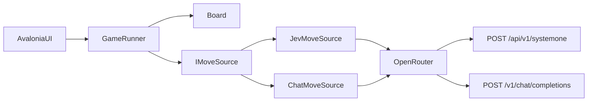

# AI vs AI Connect 4 (C# / Avalonia)

A watchable desktop arena. Board in the centre. One model picker on each side. Default is Jev 1.13 (Red, left) against Luna (Yellow, right). Both sides call OpenRouter with `OPENROUTER_API_KEY`.

Jev is not a chat model. It takes a board `state` and a typed Choice question and returns a column plus probabilities. GPT-family models (including Luna) use `/v1/chat/completions` and may accept reasoning effort and provider speed routing.

## Domain types (name these before code)

- `Column`. Values 1 through 7 only. Array index is `column - 1`. No 0-based column type.
- `Player`. Red or Yellow. Left and right are UI only.
- `Board`. Immutable 6x7 grid. Row 0 is the bottom. `Drop(Player, Column)` returns a new board or rejects the column. `LegalColumns()` returns 1-7.
- `GameStatus`. `Ready | Running | Paused | Finished(Win(Player, WinningLine) | Draw) | Aborted(reason)`. Not a pile of bools.
- `Move`. Player, Column, `Model` or `Retry`. No silent fallback column.
- `MoveTiming`. Player, duration, `Applied | Aborted | Cancelled`.
- `ModelProfile`. Display name, model id, `ApiKind` (`SystemOne` | `ChatCompletions`), `SupportsEffort`, `SupportsSpeed`.
- `IMoveSource`. `GetMoveAsync(Board, Player, CancellationToken)` returns a `Column` or a typed failure. Adapters close over `ModelProfile`. Core has no `MoveOptions` bag.
- `GameRunner`. Headless owner of status, clock, and drop. Avalonia binds to it. No `HttpClient` or Avalonia types in Core.

Illegal states to make unrepresentable:

- `Running` with no API key (Play stays disabled in `Ready`)
- `Running` and `Paused` at once
- a Jev / System One request that carries `reasoning.effort` or `provider.sort`
- a parsed column of 0 next to prompt copy that says 1-7
- `Finished` still accepting `Drop`

## Project layout

Two assemblies, not three.

- `AIConnect4.sln`
- `src/AIConnect4.Core`. Board, Column, Player, GameStatus, Move, serialize, parse 1-7, IMoveSource, GameRunner, MoveTiming
- `src/AIConnect4.App`. Avalonia 11, composition, env key, `OpenRouter/` folder (HttpClient, JevMoveSource, ChatMoveSource, ModelCatalog)
- `tests/AIConnect4.Tests`. Board rules, parsers, catalog flags, ScriptedMoveSource full games, timing that ignores the watch pause
- `README.md`

Do not add `src/AIConnect4.OpenRouter`. The seam is `IMoveSource`, not a csproj.

## Testable design

**Core (pure plus headless runner).** Drop, legal columns, win/draw, apply a validated move, serialise board state, parse a column in 1-7, `GameRunner` with a `Stopwatch` around `GetMoveAsync`.

**Effects (App).** HTTP to OpenRouter, UI updates, a fixed ~400 ms watch pause between moves (`TimeSpan.Zero` in tests). The pause is not in the decision clock.

**Seams.** `IMoveSource` implemented by `JevMoveSource` and `ChatMoveSource`. `HttpMessageHandler` injected at App composition. Tests use `ScriptedMoveSource`.

**Composition.** App startup reads `OPENROUTER_API_KEY`. Missing key leaves `Ready` and disables Play. One `HttpClient` at `https://openrouter.ai/api/`.

**Rejected.** A third class library. A TypeSafe SDK. Silent fallback to the first legal column. A move-delay slider. A live OpenRouter model fetch. Mid-game model swaps.

## How each model plays

Shared board state (object, not a blob of prose):

- rules, who you are, who is to move
- 6x7 grid as `R` / `Y` / `.` with the top row printed first and row 0 as the bottom
- `legal_columns` as 1-7 from left to right
- last move, if any

**Jev.** `POST https://openrouter.ai/api/v1/systemone`

- default model `typesafe/jev-1.13` (catalog also lists `~typesafe/jev-latest` as an explicit floating option)
- one Choice question. Which legal column should you play?
- `criteria` includes only legal columns
- use returned `choice`. Show `probabilities` and `confidence` on that side panel
- never send `reasoning.effort` or `provider.sort`

**Chat models (Luna and others).** `POST https://openrouter.ai/api/v1/chat/completions`

- default `openai/gpt-5.6-luna`
- ask for JSON `{ "column": 1-7, "reason": "..." }` via `response_format` json_schema when the catalog says it is supported. Else json_object. Else the first integer in 1-7
- effort and `provider.sort` only when the profile allows them and the user set them

**Illegal, empty, unparseable, timeout.** One retry with the error in the prompt (chat and Jev). Still bad, then abort the game, keep the time spent, show the error on that side. Do not invent a column. Do not crash the process.

## Effort and speed

Per-side controls, enabled only when `ModelProfile` says so. Jev and any `typesafe/` or `~typesafe/` id disable both at the type and request layer, not only by hiding sliders.

- Effort. `reasoning.effort` = `none | minimal | low | medium | high | xhigh`. Luna defaults to `medium`. Custom chat defaults to omit. If a custom chat 400s on that field, retry once with the field stripped.
- Speed. OpenRouter `provider.sort`, not animation speed. Labels are Default (omit the field), Throughput, and Low latency. Do not label throughput "Fastest".

A fixed ~400 ms pause between applied moves keeps the match watchable. It is UI pacing. It does not count toward decision time. No slider.

## Model catalog

Curated dropdown plus a Custom row that reveals a model-id text box.

Starter list:

- Jev 1.13. `typesafe/jev-1.13`. System One. Default left. No effort/speed
- Jev Latest. `~typesafe/jev-latest`. System One. Floating alias. No effort/speed
- Luna. `openai/gpt-5.6-luna`. Chat. Default right. Effort + speed
- A few other chat models (GPT-5.6 Sol, a Claude, a cheaper GPT)

Any `typesafe/` or `~typesafe/` custom id is System One. Other custom ids are chat. Show effort/speed for custom chat. Default both to omit.

## Decision timing

`GameRunner` times only the model call, including one retry. Watch pause, board paint, and UI work are excluded.

Each completed or aborted call stores a `MoveTiming`. The runner exposes last time for that side, running total for that side, and combined total.

While a side is thinking, that panel shows a live elapsed timer bound to the runner. After the move lands, that panel shows last and total. When the game ends (win, draw, or abort), the centre status shows Red total, Yellow total, and combined.

New Game cancels the in-flight token, clears board, logs, and timings, and returns to `Ready`. Do not dispose the shared `HttpClient`. Marshal HTTP completions onto the Avalonia dispatcher before touching bound properties.

## Avalonia UI

Three-column layout:

- Left / Red. Model, effort, speed, live thinking timer, last decision time, running total, last answer
- Centre. 7x6 disc board, last-move highlight, winning-line highlight, Play / Pause / New Game, whose turn / winner / abort reason, end-of-game time summary
- Right / Yellow. Same controls as left

Defaults. Left = Jev 1.13. Right = Luna. Effort medium. Speed Default.

Settings lock when Play starts. Pause waits for the in-flight move, then freezes. Resume uses the same models. Change model, effort, or speed only from `Ready`. No human column clicks.

## Docs and verification

README covers `dotnet run --project src/AIConnect4.App`, `OPENROUTER_API_KEY`, the Jev vs chat difference, and abort-on-illegal-move.

Tests cover gravity, wins (H/V/both diagonals), draws, Column 1-7 parsing, legal-column filtering, Jev/chat answer parsing, catalog capability flags, ScriptedMoveSource games (alternation, win/draw stop, abort on illegal), and per-side / combined totals that ignore the watch pause.

After implementation, run the tests and `dotnet build`. Launch the app locally to watch a match.
